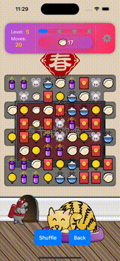
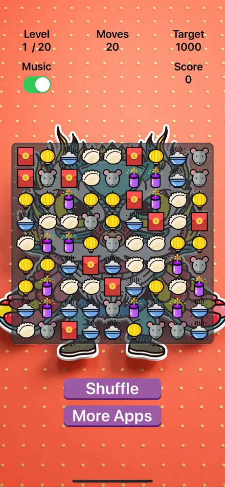
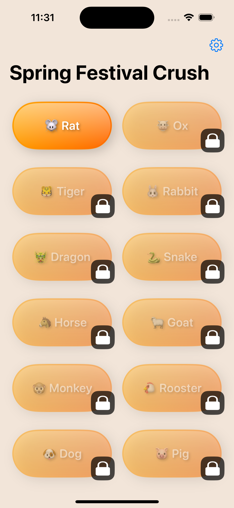

# Landmark Adventure: China - Match 3

## Overview

**Landmark Adventure: China - Match 3** is an exciting match-3 puzzle game that takes you on a journey through China's most iconic landmarks. Immerse yourself in a world filled with breathtaking scenery, challenging puzzles, and stunning graphics that celebrate the rich history and beauty of China's cultural treasures.

## Features

- 🎉 **Spring Festival Extravaganza**: Immerse yourself in the rich culture of China as you explore beautifully themed levels featuring famous landmarks, special cultural elements, and exciting surprises that bring these iconic sites to life.

- 🧩 **Mind-Bending Challenges**: Tackle a wide range of levels, each with its own twist. From tricky puzzles to innovative mechanics, every stage offers a fresh test of your strategy and problem-solving skills.

- ⚡ **Effortless Play, Stunning Visuals**: Glide through the game with ultra-smooth animations and intuitive controls, all while enjoying a visually captivating experience designed to keep you hooked.

## Screenshots

    
    
    

## 🧳 Requirements

- **iOS Version**: iOS 17.0 or later
- **Compatible Devices**: iPhone, iPad
- Swift 5+

## How to Play

1. **3 or More Match**: Swipe to line up three or more identical items to clear them from the board.
2. **Objectives**: Reach the goals for each level within a set number of moves or time limit.
3. **Levels**: Move through harder levels and unlock new challenges as you continue playing.

## Tech Stack

- **Language**: Swift
- **Framework**: SpriteKit, SwiftUI, Swift Concurrency, SwiftData
- **Ad Integration**: Google AdMob
